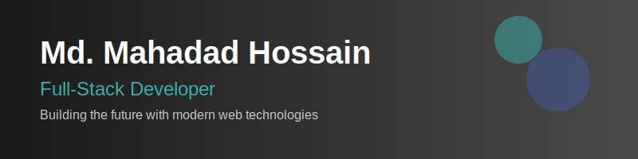

<div align="center">
  
# Welcome to My Digital Universe! 👨‍💻

[](https://mehdad-portfolio.vercel.app/)
[](https://www.linkedin.com/in/md-mahadad-hossain-38988725a/)
[](https://twitter.com/)
[](mailto:hussain.mehdad1@gmail.com)

</div>

## 🎯 Professional Summary

> "Code is like humor. When you have to explain it, it's bad." 

Passionate Full-Stack Developer specializing in building scalable, performant web applications. With expertise spanning the entire development stack, I craft elegant solutions that prioritize user experience and technical excellence.

### 🎓 Current Focus
- Architecting applications with **Next.js 13, 14, 15**
- Implementing **React Server Components** for optimal performance
- Exploring AI/ML integrations using **OpenAI** and **LangChain**
- Building robust backend systems with **Node.js** and **Go**

## 💻 Technical Arsenal

<details>
<summary>🎨 Frontend Ecosystem</summary>

```javascript
const frontend = {
  languages: ['JavaScript', 'TypeScript'],
  frameworks: {
    primary: ['React', 'Next.js'],
    additional: ['Angular', 'Vue.js'],
    mobile: ['React Native']
  },
  styling: ['Tailwind CSS', 'ShadCN UI'],
  stateManagement: [
    'Zustand',
    'Redux Toolkit',
    'TanStack Query',
    'Pinia',
    'Signal Store',
    'RxJS'
  ]
}
```
</details>

<details>
<summary>⚙️ Backend Mastery</summary>

```javascript
const backend = {
  runtime: ['Node.js', 'Go'],
  frameworks: ['Hono.js', 'Express JS', 'Nest JS'],
  databases: {
    sql: ['PostgreSQL', 'MySQL'],
    nosql: ['MongoDB'],
    orm: ['Prisma', 'Drizzle', 'Mongoose']
  },
  cloud: ['Vercel', 'Neon']
}
```
</details>

<details>
<summary>🛠️ Development Tools</summary>

```javascript
const tooling = {
  editor: 'VSCode',
  versionControl: 'Git',
  containerization: 'Docker',
  testing: ['Jest', 'React Testing Library'],
  api: 'Postman'
}
```
</details>

## 📊 GitHub Analytics

<div align="center">
  
  
  
  
</div>

## 🌟 Featured Projects

<div align="center">

[](https://github.com/mehdad-hussain/your-repo-name)

</div>

## 💭 Philosophy

- **Clean Code Advocate**: Believing in the power of readable, maintainable code
- **Continuous Learner**: Always exploring new technologies and best practices
- **Open Source Enthusiast**: Contributing to and learning from the community

## 📬 Let's Connect

I'm always open to interesting conversations and collaboration opportunities. Feel free to reach out through any of the platforms above!

<div align="center">
  <h3>"Building tomorrow's web, one commit at a time"</h3>
  
<!-- Option 2: Using shields.io with GitHub profile views -->

  
  <!-- GitHub followers -->
  
  
  <!-- GitHub stars -->
  
</div>

---


